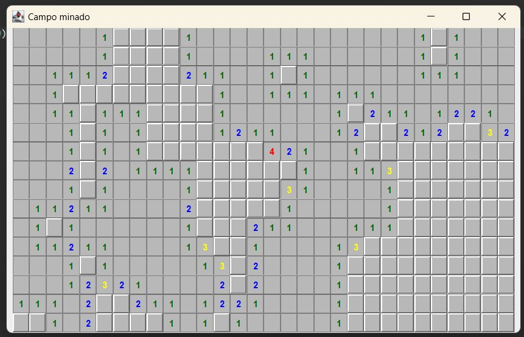

# Projeto Minefield (Campo minado)

## Descrição geral

- ### Estrutura do projeto  
  O código foi organizado de maneira modular para garantir clareza e fácil manutenção. A arquitetura segue uma separação lógica entre diferentes camadas:

  - Pacote logica:  
    
    É onde armazena as classes com a parte lógica do projeto, nele as funções se baseiam em como o jogador vai interagir com o tabuleiro, os botões, os campos que estão abertos, fechados, sinalizados ou minados.

    - Classe campo: Maneja principalmente a base do jogo como os campos que são minados e o que acontece caso o jogador selecione um deles, e caso o jogador selecione um campo que não tenha nenhuma bomba na "vizinhança";
    - Classe campoEvento: É a classe que armazena um enum com os valores ABRIR, MARCAR, DESMARCAR, EXPLODIR e REINICIAR;
    - Classe campoObservador: É uma interface que relaciona os eventos com o campo, por meio das últimas duas classes;
    - Classe resultadoEvento: É a classe que dispara a mensagem de vitória e toda as outras funções de reiniciar o jogo caso o jogador queira;
    - Classe tabuleiro: Esta classe recebe 3 valores (n° de colunas, n° de linhas e n° de minas) e os redireciona para as devidas funções, como "construir" o campo, distribuir as minas em colunas e linhas aleatórias, dar o jogo como encerrado e entre outros;
  - Pacote visao:  

    Este pacote trata das informações que o jogador vizualiza e como a parte lógica vai se apresentar para o usuário.
      - Classe botaoCampo: Esta classe é responsável por selecionar as cores que cada botão irá representar dependendo do seu estado também tendo um Event Listener implantado para os cliques do mouse e outras funções do sistema;
      - Classe painelTabuleiro: Essa classe tem como função principal a construção do campo com um layout em grade, além de acionar a mensagem de vitória ou derrota por meio do JOptionPane.
      - Classe telaPrincipal: Nessa classe que se situa a função Main do projeto, que é onde reúne todas as outras classes e funções e por consequência é onde é possível escolher o número de linhas, colunas e bombas distribuidas; 

## Tecnologias usadas:

## Resultados

